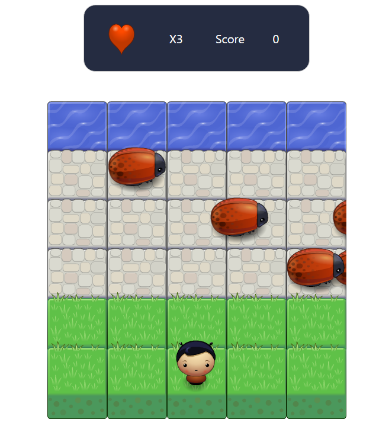

# Arcade Game

This Game is made with pure JavaScript and Html5 Canvas.
here is the image from the game . 

### how to win?
simply you should cross th character to the water.

### how to play?
open the [live Preview](https://muhammedemad.github.io/Arcade-game/.).
use the arrow keys only to control in your character.

### Rules
Each time the character arrive to the water you will gain 20 point.
Each time the Enemy touch the player you will lose 1 live.
You have only 3 times to try.

